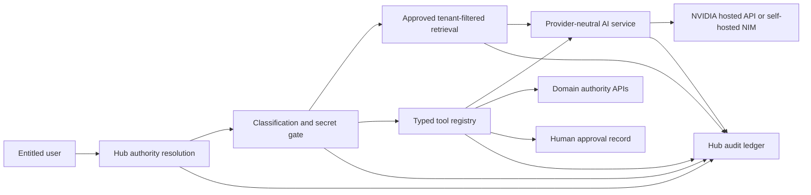

# MacTech AI Architecture

Status: implemented on feature branch; locally testable; not deployed.

MacTech AI is a bounded Hub module. Hub remains authoritative for identity, organization context, permissions, entitlements, cross-app references, and audit. Domain apps remain authoritative for opportunities, proposals, pricing, governance, QMS, training, contracts, finance, and secure evidence. The AI layer retrieves approved references and calls explicit domain APIs; it does not copy domain databases into Hub.

The implementation lives under `lib/ai/` with provider, authority, classification, retrieval, tools, approval staging, audit, prompt, and schema boundaries. API routes live under `app/api/ai/`; the entitled UI lives at `/admin/ai`.

The development retrieval corpus is synthetic/public and is materialized for the already-authorized tenant. Production retrieval must replace this adapter with approved PostgreSQL/pgvector or another isolated store while retaining the same authorization metadata contract.
